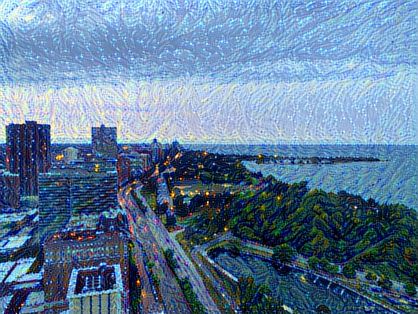
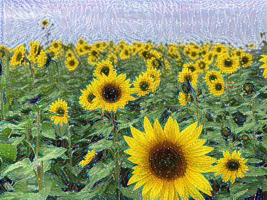
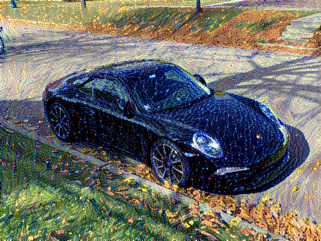

### Neural style transfer

#### Introduction
Style transfer consists in generating an image with the same "content" as a base image, but with the "style" of a different picture (typically artistic). This is achieved through the optimization of a loss function that has 3 components: "style loss", "content loss", and "total variation loss":
* _The total variation loss imposes local spatial continuity between the pixels of the combination image, giving it visual coherence._
* _The style loss is where the deep learning keeps in --that one is defined using a deep convolutional neural network. Precisely, it consists in a sum of L2 distances between the Gram matrices of the representations of the base image and the style reference image, extracted from different layers of a convnet (trained on ImageNet). The general idea is to capture color/texture information at different spatial scales (fairly large scales --defined by the depth of the layer considered)._
* _The content loss is a L2 distance between the features of the base image (extracted from a deep layer) and the features of the combination image, keeping the generated image close enough to the original one._

